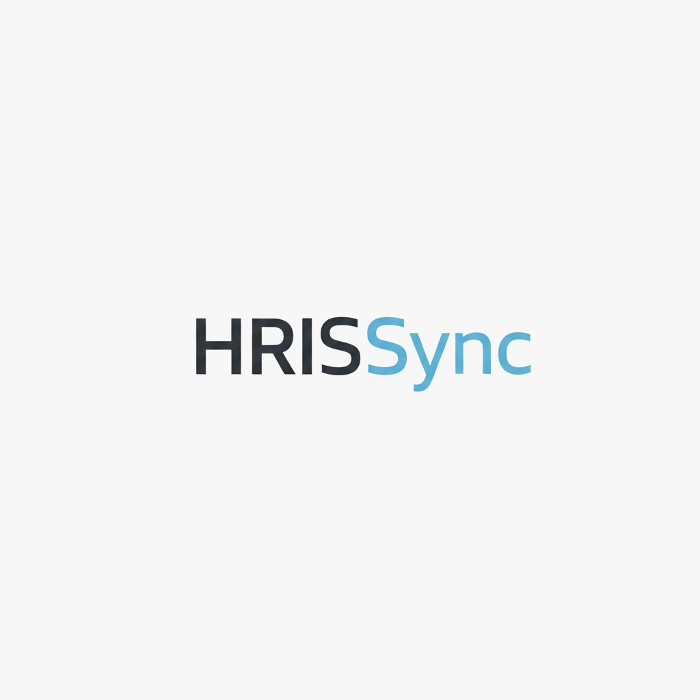

# 🏢 HRIS Backend - Laravel

> **Human Resource Information System**  
> Complete REST API Backend with JWT Authentication

---

## 📖 Tentang Proyek

**HRIS Backend Laravel SIB** adalah sistem backend REST API lengkap untuk manajemen Human Resource (HR). Sistem ini dirancang untuk memudahkan pengelolaan karyawan, absensi, cuti, penilaian kinerja, slip gaji, dan notifikasi dalam satu platform terintegrasi.

### ✨ Fitur Utama

| Modul | Deskripsi |
|-------|-----------|
| 🔐 **JWT Authentication** | Login/Logout dengan secure token |
| 👥 **Employee Management** | CRUD karyawan lengkap dengan filter |
| ⏰ **Attendance System** | Check-in/out dengan auto-calculate work hours |
| 🏖️ **Leave Management** | Pengajuan & approval cuti |
| ⭐ **Performance Reviews** | Penilaian kinerja karyawan (1-10 stars) |
| 💰 **Salary Slips** | Generate slip gaji bulanan otomatis |
| 🛡️ **RBAC** | Role-Based Access Control (Admin HR, Manager, Employee) |
| 🔔 **Notifications** | Real-time notification & broadcast system |

---

### Terima kasih telah menggunakan HRIS Backend kami! 🙏

Proyek ini dikembangkan dengan sepenuh hati oleh tim kami untuk membantu  
mempermudah pengelolaan SDM di perusahaan Anda.

**Tim Pengembang:**  
| 👤 Nama | 💼 Role |
|---------|---------|
| **Eko Muchamad Haryono** | Lead Backend Developer |
| **Raka Muhammad Rabbani** | Backend Developer |
| **Ryandra Athaya Saleh** | Lead Frontend Developer |
| **Octaviani Nursalsabila** | UI/UX Developer |
| **Yossy Indra Kusuma** | Frontend Developer |
